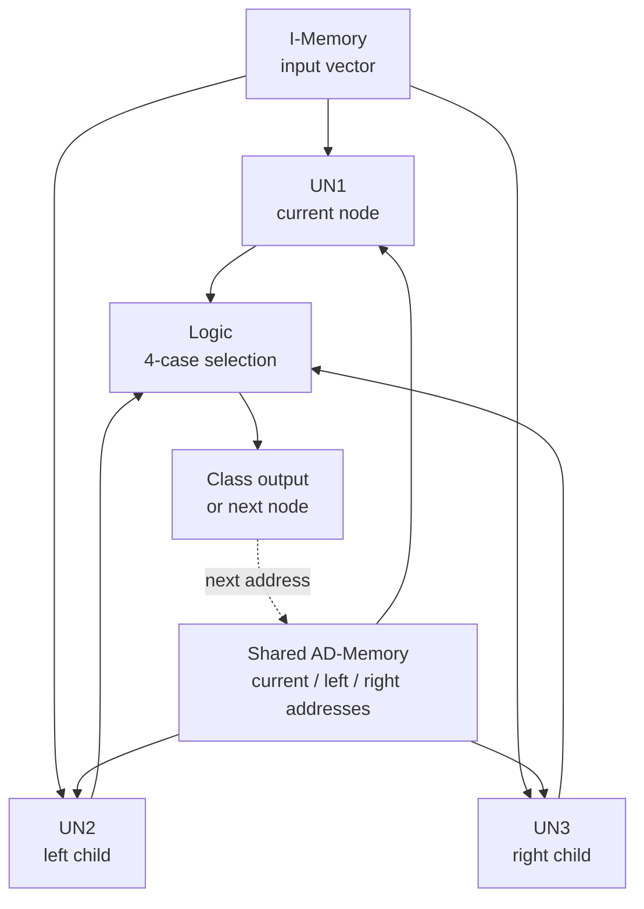

# Parallel Decision Tree Hardware

**Conference Paper Project · FPGA-Based Parallel Decision Tree Classifier**

한 입력 벡터의 현재 노드와 좌·우 자식 노드를 동시에 계산해 결정트리 탐색 시간을 줄이는 RTL 분류기입니다.

- **Paper:** 병렬 구조 기반 결정트리 하드웨어 설계 및 분석
- **English title:** Parallel Decision Tree Hardware Design and Analysis
- **Venue:** 2025 한국스마트미디어학회 추계학술대회 논문
- **Authors:** SeungYeol Lee, Chung-Soo Lim

> 최종 논문은 `LOAD → COMPARE → DECISION → DONE`의 4-state FSM을 명시합니다. 이 저장소는 복구 기록에서 확인된 6-state 개발 구현과 논문 명세에 맞춘 4-state 구현을 분리하고, 동일한 37개 벡터로 기능 동등성을 검증합니다. 원문으로 확인된 사실과 기능 재구성 항목은 [Recovery Notes](./parallel-decision-tree/docs/recovery-notes.md)에 구분했습니다.

## Research Contribution

- 여러 입력을 동시에 처리하는 batch parallelism이 아니라, **한 입력 벡터 내부의 트리 탐색**을 병렬화했습니다.
- UN1이 현재 노드를 계산하는 동안 UN2·UN3이 좌·우 자식 노드를 미리 계산하는 speculative execution 구조입니다.
- 자식이 node/leaf인 네 가지 조합을 Logic이 판별해 다음 주소 또는 class를 선택합니다.
- 공유 I-Memory·AD-Memory와 동기 레지스터를 사용해 세 UN의 데이터 흐름을 정렬합니다.

## Paper Specification and Repository Implementations

| Item | Control Flow | Role |
|---|---|---|
| Final paper specification | `LOAD → COMPARE → DECISION → DONE` | 논문에 명시된 4-state 구조 |
| [Recovered 6-state](./parallel-decision-tree/rtl/recovered_6state/top_prefetch_un3.v) | `IDLE → LOAD → PREFETCH → DECIDE → DONE → ADVANCE` | 복구 기록과 과거 합성 로그를 바탕으로 재구성한 개발 구현 |
| [Paper-aligned 4-state](./parallel-decision-tree/rtl/refined_4state/top_prefetch_un3_4state.v) | `LOAD → COMPARE → DECISION → DONE` | 논문 제어 흐름을 구현하고 제어 상태를 통합한 버전 |

두 RTL 버전은 공통 데이터패스를 사용하므로 FSM 변화가 분류 결과와 완료 사이클에 미치는 영향을 직접 비교할 수 있습니다.

## Repository Regression Results

| Verification | Result |
|---|---:|
| Recovered 6-state classification | **37 / 37 PASS** |
| Paper-aligned 4-state classification | **37 / 37 equivalent** |
| Recovered batch completion cycles | **293 → 255** |
| Recovered test-batch cycle reduction | **약 13.0%** |
| Regression | **GitHub Actions + Icarus Verilog** |

`293 → 255`는 복구 RTL에 새로 구성한 37-vector regression 결과이며, 아래의 논문 Vivado 결과를 재현한 수치가 아닙니다.

## Architecture



각 UN 내부는 A-Memory의 attribute/threshold, C-Memory의 child class 정보, 비교 연산부와 Decision 로직으로 구성됩니다.

## Four Logic Cases

| Case | Left Child | Right Child | Logic Result |
|---:|---|---|---|
| 1 | Node | Node | 선택된 자식 주소로 탐색 계속 |
| 2 | Node | Leaf | 분기 방향에 따라 next node 또는 class |
| 3 | Leaf | Node | 분기 방향에 따라 class 또는 next node |
| 4 | Leaf | Leaf | class 확정 후 탐색 종료 |

## Paper-Reported FPGA Results

최종 논문이 보고한 Xilinx Artix-7 Vivado 합성 결과입니다. 새 복구 RTL의 재합성 결과로 주장하지 않습니다.

| Metric | Single UN | Parallel UN3 |
|---|---:|---:|
| LUT | 1,247 | 2,884 |
| FF | 2,309 | 2,516 |
| Clock period | 13.10 ns | 13.10 ns |
| Effective frequency | 약 76.3 MHz | 약 76.3 MHz |
| Total on-chip power | 0.084 W | 0.229 W |

| Tree Level | Single | Parallel | Speedup | Cycle Reduction |
|---|---:|---:|---:|---:|
| LV2 | 6 cycles | 4 cycles | 1.50× | 33.3% |
| LV3 | 9 cycles | 8 cycles | 1.12× | 11.1% |
| LV4 | 12 cycles | 8 cycles | 1.50× | 33.3% |
| Paper average | - | - | **1.37×** | - |

계산 기준과 논문 문구의 해석은 [Paper Reference](./parallel-decision-tree/docs/paper-reference.md)에 기록했습니다.

## Repository Structure

```text
parallel-decision-tree/
├── rtl/
│   ├── common/              # I-Memory, address, decision unit, selection logic
│   ├── recovered_6state/    # reconstructed development implementation
│   └── refined_4state/      # paper-aligned FSM
├── tb/                      # 37-vector and equivalence tests
├── scripts/                 # Icarus Verilog regression
├── docs/                    # paper reference and recovery evidence
└── README.md                # detailed technical documentation
```

## Verification

```bash
bash parallel-decision-tree/scripts/run_iverilog.sh
```

The regression performs:

1. 37-vector classification with the recovered 6-state RTL
2. Expected-class comparison and DONE-state assertion
3. 37-vector output equivalence between the 6-state and 4-state RTL
4. Batch completion-cycle comparison

## Recovery Scope

- **Paper-confirmed:** UN1–UN3 parallel structure, shared memories, four Logic cases, 4-state FSM, Artix-7 synthesis table
- **Recovery-record-confirmed:** source filenames, parameters, 6-state development control flow and historical synthesis log
- **Functionally reconstructed:** unavailable AD/A/C/I-Memory contents
- **Newly verified:** 37-vector regression, 6-state/4-state equivalence, 293→255 batch-cycle reduction
- **Not yet reproduced:** new Vivado synthesis and timing report for the recovered RTL

## Project Links

- [Detailed Project README](./parallel-decision-tree/README.md)
- [Paper Reference](./parallel-decision-tree/docs/paper-reference.md)
- [Recovered 6-state RTL](./parallel-decision-tree/rtl/recovered_6state)
- [Paper-aligned 4-state RTL](./parallel-decision-tree/rtl/refined_4state)
- [Testbenches](./parallel-decision-tree/tb)
- [Recovery Notes](./parallel-decision-tree/docs/recovery-notes.md)
