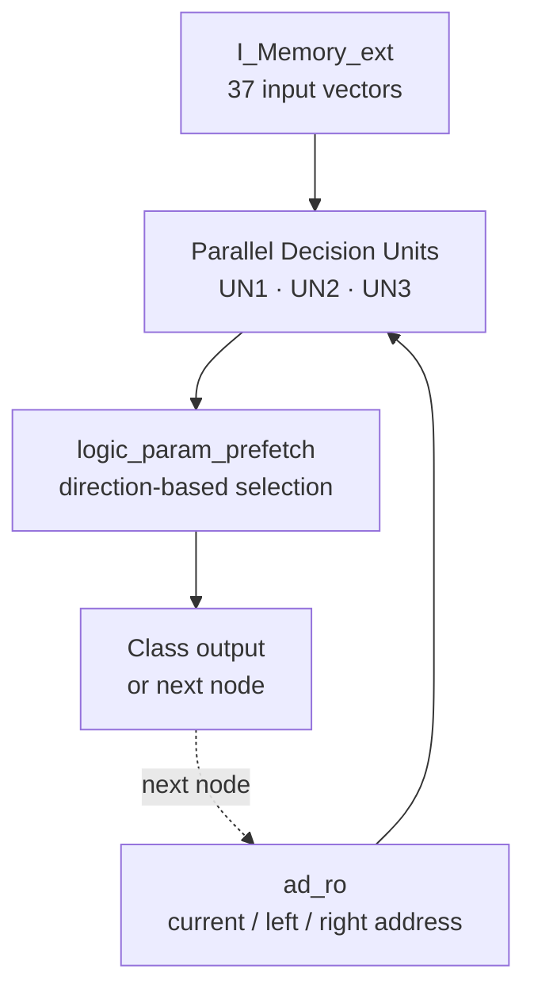

# Parallel Decision Tree Hardware

**Graduation Thesis · FPGA-Based Parallel Decision Tree Classifier**

FPGA에서 현재 노드와 두 자식 노드를 동시에 계산하여 결정트리 탐색 시간을 줄이는 RTL 분류기입니다. 학술대회 당시의 **recovered 6-state** 구조와 제어 흐름을 정리한 **refined 4-state** 구조를 분리하고, 동일한 37개 입력 벡터로 기능 동등성을 검증했습니다.

> 이 프로젝트는 유실된 원본 소스를 채팅 기록, 최종 논문, 합성 결과를 근거로 재구성한 기능 동등 복구본입니다. 원문으로 확인된 사실과 추론·재구성한 내용은 [Recovery Notes](./parallel-decision-tree/docs/recovery-notes.md)에 구분했습니다.

## Key Results

| Verification | Result |
|---|---:|
| Recovered 6-state classification | **37 / 37 PASS** |
| Refined 4-state classification | **37 / 37 equivalent** |
| Batch completion cycles | **293 → 255** |
| Cycle reduction in recovered test batch | **약 13.0%** |
| Paper-reported maximum latency reduction | **50%** |
| Regression | **GitHub Actions + Icarus Verilog** |

## Architecture



- **UN1** evaluates the current node.
- **UN2 / UN3** precompute the left and right child nodes in parallel.
- **Logic** selects the required child result from the UN1 direction.
- A leaf produces the class; a node address continues the next parallel search.

## RTL Versions

| Version | FSM | Purpose |
|---|---|---|
| [Recovered 6-state](./parallel-decision-tree/rtl/recovered_6state/top_prefetch_un3.v) | IDLE · LOAD · PREFETCH · DECIDE · DONE · ADVANCE | 학술대회 당시 동작을 기능 동등하게 복구 |
| [Refined 4-state](./parallel-decision-tree/rtl/refined_4state/top_prefetch_un3_4state.v) | LOAD · COMPARE · DECISION · DONE | 불필요한 제어 상태를 통합한 개선 구조 |

두 버전은 공통 데이터패스를 사용하므로 FSM 변화가 분류 결과와 완료 사이클에 미치는 영향을 직접 비교할 수 있습니다.

## Repository Structure

```text
parallel-decision-tree/
├── rtl/
│   ├── common/              # I-Memory, address, decision unit, selection logic
│   ├── recovered_6state/    # recovered conference FSM
│   └── refined_4state/      # refined FSM
├── tb/                      # 37-vector and equivalence tests
├── scripts/                 # Icarus Verilog regression
├── docs/                    # recovery evidence and reconstruction notes
└── README.md                # detailed technical documentation
```

## Verification

```bash
bash parallel-decision-tree/scripts/run_iverilog.sh
```

The regression performs:

1. Classification of all 37 vectors with the recovered 6-state RTL
2. Expected-class comparison and DONE-state assertion
3. 37-vector output equivalence between 6-state and 4-state RTL
4. Batch completion-cycle comparison

## Paper-Reported FPGA Results

The values below are reproduced from the final paper and are **not claimed as a new synthesis result for the recovered RTL**.

| Metric | Single UN | Parallel UN3 |
|---|---:|---:|
| LUT | 1,247 | 2,884 |
| FF | 2,309 | 2,516 |
| Operating period | 13.10 ns | 13.10 ns |
| Power | 0.084 W | 0.229 W |

Reported tree-level cycles were LV2 `6→4`, LV3 `9→8`, and LV4 `12→8`. The paper reported an average speedup of 1.37× and a maximum reduction of 50%.

## Recovery Scope

- **Verified evidence:** filenames, module roles, UN1–UN3 parallel structure, FSM waveform/state evidence, paper synthesis table
- **Functionally reconstructed:** AD/A/C/I-Memory contents whose original source was unavailable
- **Newly verified:** 37-vector regression, 6-state/4-state equivalence, 293→255 batch-cycle reduction
- **Not yet reproduced:** new Vivado synthesis and timing report for the recovered RTL

## Project Links

- [Detailed Project README](./parallel-decision-tree/README.md)
- [Recovered 6-state RTL](./parallel-decision-tree/rtl/recovered_6state)
- [Refined 4-state RTL](./parallel-decision-tree/rtl/refined_4state)
- [Testbenches](./parallel-decision-tree/tb)
- [Recovery Notes](./parallel-decision-tree/docs/recovery-notes.md)
