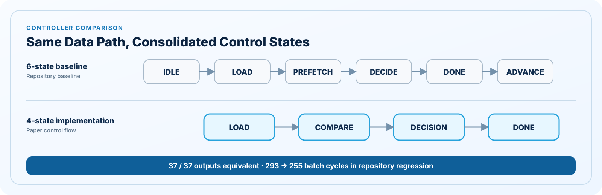
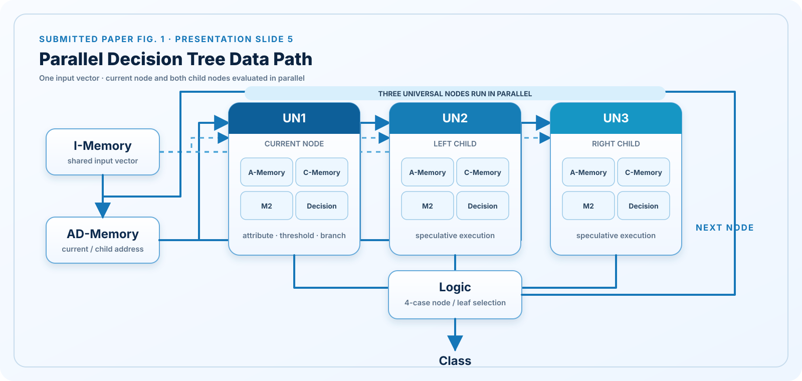
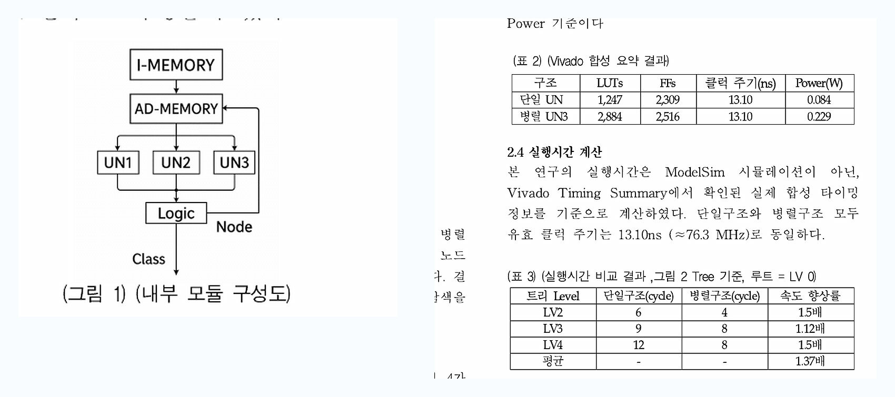

# Parallel Decision Tree Hardware

**Conference Paper Project · FPGA-Based Parallel Decision Tree Classifier**

한 입력 벡터의 현재 노드와 좌·우 자식 노드를 동시에 계산해 결정트리 탐색 시간을 줄이는 RTL 분류기입니다.

**Portfolio focus:** RTL architecture · FSM refinement · equivalence verification

- **Paper:** 병렬 구조 기반 결정트리 하드웨어 설계 및 분석
- **English title:** Parallel Decision Tree Hardware Design and Analysis
- **Venue:** 2025 한국스마트미디어학회 추계학술대회 논문
- **Authors:** SeungYeol Lee, Chung-Soo Lim

> **Development path:** 개발 과정의 6-state 제어 흐름을 baseline으로 두고, `IDLE`과 `ADVANCE`의 역할을 기존 상태에 통합한 4-state 구현으로 개선했습니다. 최종 제출 논문은 `LOAD → COMPARE → DECISION → DONE`의 4-state FSM을 명시하며, 현재 저장소의 4-state RTL은 이 논문 명세에 맞춰 구현되어 있습니다.

## Research Contribution

- 여러 입력을 동시에 처리하는 batch parallelism이 아니라, **한 입력 벡터 내부의 트리 탐색**을 병렬화했습니다.
- UN1이 현재 노드를 계산하는 동안 UN2·UN3이 좌·우 자식 노드를 미리 계산하는 speculative execution 구조입니다.
- 자식이 node/leaf인 네 가지 조합을 Logic이 판별해 다음 주소 또는 class를 선택합니다.
- 공유 I-Memory·AD-Memory와 동기 레지스터를 사용해 세 UN의 데이터 흐름을 정렬합니다.

## Development Path and Paper Implementation

| Stage | Control Flow | Role |
|---|---|---|
| [1. 6-state development baseline](./parallel-decision-tree/rtl/recovered_6state/top_prefetch_un3.v) | `IDLE → LOAD → PREFETCH → DECIDE → DONE → ADVANCE` | 개발 단계의 세분화된 제어 흐름을 현재 저장소에서 기능적으로 재구성한 기준 구현 |
| [2. Refined 4-state implementation](./parallel-decision-tree/rtl/refined_4state/top_prefetch_un3_4state.v) | `LOAD → COMPARE → DECISION → DONE` | 대기와 다음 벡터 제어를 기존 상태에 통합한 개선 구현 |
| 3. Submitted paper specification | `LOAD → COMPARE → DECISION → DONE` | 최종 제출 논문에 명시된 제어 흐름 |

두 버전은 I-Memory, AD-Memory, UN1–UN3, Logic으로 구성된 동일한 데이터패스를 공유합니다. 따라서 테스트에서는 FSM 변경이 분류 결과와 완료 사이클에 미치는 영향만 비교합니다.

<p align="center">
  
</p>


## Repository Regression Results

| Verification | Result |
|---|---:|
| 6-state development baseline | **37 / 37 PASS** |
| 4-state paper-aligned implementation | **37 / 37 equivalent** |
| Batch completion cycles | **293 → 255** |
| Cycle reduction | **약 13.0%** |
| Regression | **GitHub Actions + Icarus Verilog** |

`293 → 255`는 저장소의 37-vector regression에서 측정한 배치 완료 사이클이며, 아래의 논문 Vivado 결과와는 별도의 검증 수치입니다.

## Architecture

<p align="center">
  
</p>

위 구조도는 **제출 논문 그림 1과 발표자료 5페이지**를 기준으로, GitHub에서 데이터 흐름이 한눈에 보이도록 가로형으로 다시 구성했습니다.

- I-Memory의 동일 입력 벡터와 AD-Memory의 노드 주소를 UN1·UN2·UN3이 공유합니다.
- UN1은 현재 노드, UN2·UN3은 좌·우 자식 노드를 같은 구간에 계산합니다.
- Logic은 네 가지 node/leaf 조합을 판별해 class 또는 next node를 선택합니다.
- next node는 AD-Memory로 피드백되어 탐색을 반복합니다.

각 UN 내부는 A-Memory의 attribute/threshold, C-Memory의 child class 정보, M2 비교 연산부와 Decision 로직으로 구성됩니다.

<details>
<summary><strong>제출 논문의 원본 그림과 결과표 보기</strong></summary>
<br>
<p align="center">
  
</p>
<p>2025 한국스마트미디어학회 추계학술대회 제출 논문 2페이지의 그림 1, 표 2, 표 3 발췌본입니다. 위의 정리된 구조도와 아래 수치의 원본 근거로 사용했습니다.</p>
</details>

## Four Logic Cases

| Case | Left Child | Right Child | Logic Result |
|---:|---|---|---|
| 1 | Node | Node | 선택된 자식 주소로 탐색 계속 |
| 2 | Node | Leaf | 분기 방향에 따라 next node 또는 class |
| 3 | Leaf | Node | 분기 방향에 따라 class 또는 next node |
| 4 | Leaf | Leaf | class 확정 후 탐색 종료 |

## Paper-Reported FPGA Results

최종 논문이 보고한 Xilinx Artix-7 Vivado 합성 결과입니다. 현재 저장소 구현을 새로 합성해 얻은 수치는 아닙니다.

| Metric | Single UN | Parallel UN3 |
|---|---:|---:|
| LUT | 1,247 | 2,884 |
| FF | 2,309 | 2,516 |
| Clock period | 13.10 ns | 13.10 ns |
| Effective frequency | 약 76.3 MHz | 약 76.3 MHz |
| Total on-chip power | 0.084 W | 0.229 W |

| Tree Level | Single | Parallel | Speedup | Cycle Reduction |
|---|---:|---:|---:|---:|
| LV2 | 6 cycles | 4 cycles | 1.50× | 33.3% |
| LV3 | 9 cycles | 8 cycles | 1.12× | 11.1% |
| LV4 | 12 cycles | 8 cycles | 1.50× | 33.3% |
| Paper average | - | - | **1.37×** | - |

계산 기준과 논문 문구의 해석은 [Paper Reference](./parallel-decision-tree/docs/paper-reference.md)에 기록했습니다.

## Repository Structure

```text
parallel-decision-tree/
├── rtl/
│   ├── common/              # I-Memory, address, decision unit, selection logic
│   ├── recovered_6state/    # 6-state development baseline
│   └── refined_4state/      # 4-state paper-aligned controller
├── tb/                      # 37-vector and equivalence tests
├── scripts/                 # Icarus Verilog regression
├── docs/                    # paper source and implementation basis
└── README.md                # detailed technical documentation
```

## Verification

```bash
bash parallel-decision-tree/scripts/run_iverilog.sh
```

The regression performs:

1. 37-vector classification with the 6-state development baseline
2. Expected-class comparison and DONE-state assertion
3. 37-vector output equivalence between the 6-state and 4-state RTL
4. Batch completion-cycle comparison

## Verification Scope

- **Paper specification:** UN1–UN3 parallel structure, shared memories, four Logic cases, 4-state FSM, Artix-7 synthesis table
- **Repository implementation:** shared datapath with separate 6-state and 4-state controllers
- **Regression fixture:** deterministic AD/A/C/I-Memory tables and 37-vector test set for control-flow verification
- **Verified in CI:** 37-vector regression, 6-state/4-state equivalence, 293→255 batch-cycle reduction
- **Not yet reproduced:** current repository implementation의 Vivado synthesis 및 timing report

## Implementation Provenance

최종 제출 논문은 4-state 구조를 명시하지만 당시 소스 파일은 유실되었습니다. 현재 6-state 파일은 개발 기록을 바탕으로 구성한 baseline이며, 현재 4-state 파일은 논문 명세를 구현한 paper-aligned RTL입니다. 두 구현을 제출 당시 원본과 바이트 단위로 동일하다고 주장하지 않으며, 확인된 논문 명세와 현재 구현의 근거는 문서에서 분리해 관리합니다.

## Project Links

- [Detailed Project README](./parallel-decision-tree/README.md)
- [Paper Reference](./parallel-decision-tree/docs/paper-reference.md)
- [6-state Development RTL](./parallel-decision-tree/rtl/recovered_6state)
- [4-state Paper-Aligned RTL](./parallel-decision-tree/rtl/refined_4state)
- [Testbenches](./parallel-decision-tree/tb)
- [Implementation Basis](./parallel-decision-tree/docs/recovery-notes.md)


---

## Portfolio Navigation

[Conference Paper](https://github.com/lsy49055089/Parallel-Decision-Tree-Hardware) · [RTL / FPGA Design](https://github.com/lsy49055089/RTL-Design-Projects) · [Design Verification](https://github.com/lsy49055089/RTL-Verification-Projects) · [Embedded Systems](https://github.com/lsy49055089/Embedded-Systems-Projects) · [Edge AI / CV](https://github.com/lsy49055089/AI-Projects)
